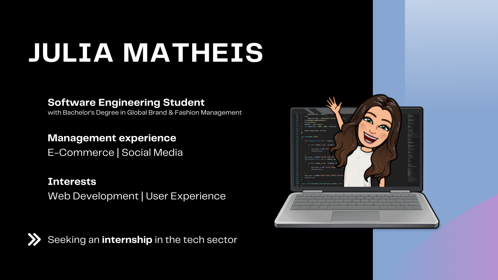
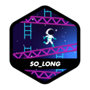
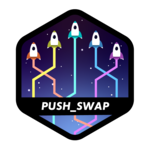
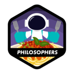
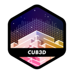
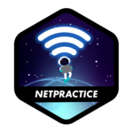
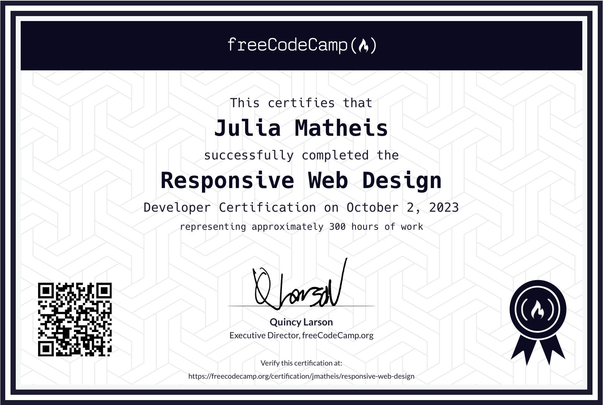
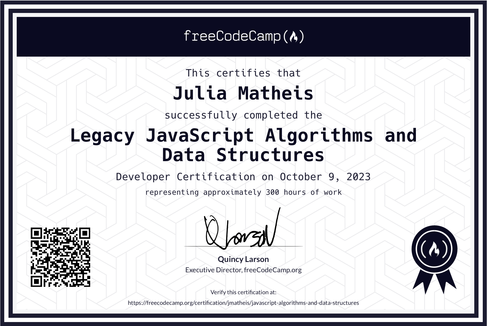

  

#### Languages & Tools
<!--  -->

<!-- 

-->

I'm currently enrolled as a student at [42 Heilbronn Programming School](https://www.42heilbronn.de/en/), close to completing the core curriculum.
> At 42, education is driven by peer learning, removing traditional teaching structures.
> Students learn through hands-on projects, promoting creativity and teamwork, while also developing real-world skills.
> This experience also builds important soft skills for the professional world, including adaptability, critical thinking, collaboration, and effective learning.
> Through the ability to independently master programming languages and ensure ongoing skill development, 42 provides a strong basis for continuous learning and personal development. Click [here](https://www.42network.org/innovative-education/) for more information.

<!--

-->
 
These are the projects I worked on as a student at 42 Heilbronn Programming School:

  
  
  

  
  
  
  
  
  
  
  
  

  
  
  
  

  
Completed certificates and courses in frontend development:
 

  
  

  
<!-- Clear floating and alignment -->
📫 How to reach me: jmatheis@student.42heilbronn.de

<!--
**jmatheis00/jmatheis00** is a ✨ _special_ ✨ repository because its `README.md` (this file) appears on your GitHub profile.

Here are some ideas to get you started:

- 🔭 I’m currently working on ...
- 🌱 I’m currently learning ...
- 👯 I’m looking to collaborate on ...
- 🤔 I’m looking for help with ...
- 💬 Ask me about ...
- 😄 Pronouns: ...
- ⚡ Fun fact: ...
-->

